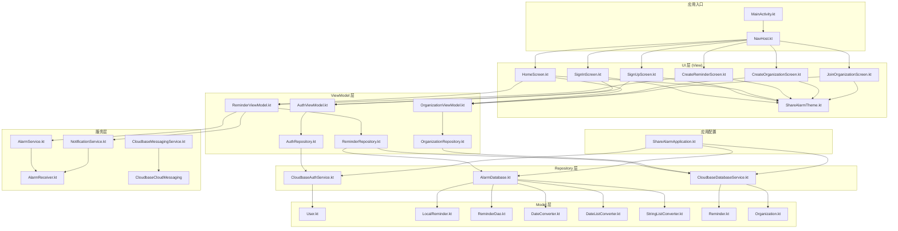
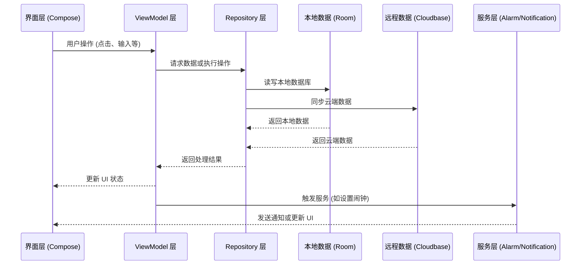
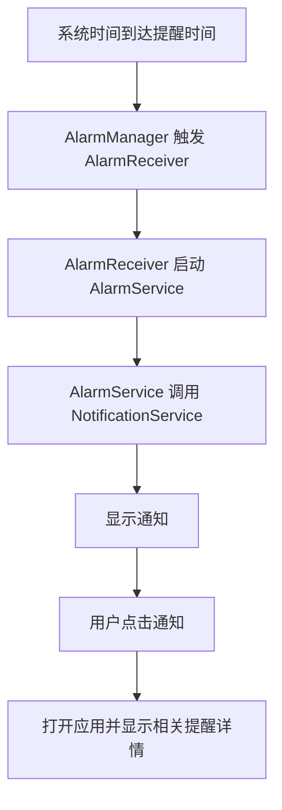

# ShareAlarm 应用代码结构与逻辑关系分析

## 1. 项目概述

ShareAlarm 是一个使用 Kotlin 和 Jetpack Compose 开发的 Android 共享闹钟应用，采用 MVVM 架构模式，支持本地数据库和云服务集成。

## 2. 技术栈

- **开发语言**: Kotlin
- **UI 框架**: Jetpack Compose
- **架构模式**: MVVM (Model-View-ViewModel)
- **本地数据库**: Room
- **云服务**: Cloudbase (已配置)
- **导航**: Navigation Compose
- **后台任务**: WorkManager

## 3. 代码结构



## 4. 核心模块分析

### 4.1 认证模块

**功能**: 处理用户注册、登录和身份验证

**流程**:
1. 用户在 `SignInScreen` 或 `SignUpScreen` 输入凭证
2. `AuthViewModel` 调用 `AuthRepository` 处理认证请求
3. `AuthRepository` 委托给具体的认证服务 (`CloudbaseAuthService`)
4. 认证结果返回给 ViewModel，再更新 UI 状态

**主要文件**:
- `AuthViewModel.kt`: 管理认证状态和用户信息
- `AuthRepository.kt`: 抽象认证逻辑，提供统一接口
- `CloudbaseAuthService.kt`: Cloudbase 认证服务实现

### 4.2 组织模块

**功能**: 管理用户组织，支持创建和加入组织

**流程**:
1. 用户在 `CreateOrganizationScreen` 创建组织或在 `JoinOrganizationScreen` 加入组织
2. `OrganizationViewModel` 调用 `OrganizationRepository` 处理组织请求
3. `OrganizationRepository` 委托给云服务 (`CloudbaseDatabaseService`)
4. 组织数据返回给 ViewModel，再更新 UI 状态

**主要文件**:
- `OrganizationViewModel.kt`: 管理组织状态和数据
- `OrganizationRepository.kt`: 抽象组织数据访问逻辑
- `Organization.kt`: 组织数据模型

### 4.3 提醒模块

**功能**: 管理闹钟提醒，支持创建、编辑和删除提醒

**流程**:
1. 用户在 `HomeScreen` 查看提醒或在 `CreateReminderScreen` 创建提醒
2. `ReminderViewModel` 调用 `ReminderRepository` 处理提醒请求
3. `ReminderRepository` 同时操作本地数据库 (`AlarmDatabase`) 和云服务
4. 提醒数据返回给 ViewModel，再更新 UI 状态
5. 当提醒触发时，`AlarmService` 启动并通过 `NotificationService` 发送通知

**主要文件**:
- `ReminderViewModel.kt`: 管理提醒状态和数据
- `ReminderRepository.kt`: 抽象提醒数据访问逻辑
- `AlarmDatabase.kt`: 本地 Room 数据库
- `Reminder.kt`: 提醒数据模型
- `LocalReminder.kt`: 本地数据库提醒实体
- `AlarmService.kt`: 闹钟服务
- `AlarmReceiver.kt`: 闹钟广播接收器

## 5. 数据流向



## 6. 依赖关系

### 6.1 核心依赖

| 依赖名称 | 版本 | 用途 |
|---------|------|------|
| androidx.core:core-ktx | 1.12.0 | Kotlin 扩展函数 |
| androidx.lifecycle:lifecycle-runtime-ktx | 2.7.0 | 生命周期管理 |
| androidx.activity:activity-compose | 1.8.2 | Compose 活动支持 |
| androidx.compose | 2024.02.01 | UI 框架 |
| androidx.room:room-runtime | 2.6.1 | 本地数据库 |
| androidx.lifecycle:lifecycle-viewmodel-ktx | 2.7.0 | ViewModel 支持 |
| androidx.navigation:navigation-compose | 2.8.0 | 导航组件 |
| androidx.work:work-runtime-ktx | 2.9.0 | 后台任务 |

### 6.2 可选依赖

| 依赖名称 | 状态 | 用途 |
|---------|------|------|
| com.tencent.cloudbase | 已配置 | 腾讯云服务 |

## 7. 关键功能流程

### 7.1 创建提醒流程

```mermaid
flowchart TD
    A[用户在 CreateReminderScreen 输入提醒信息] --> B[点击保存按钮]
    B --> C[ReminderViewModel.createReminder()]
    C --> D[ReminderRepository.insertReminder()]
    D --> E[保存到本地 Room 数据库]
    D --> F[同步到云端 Cloudbase]
    E --> G[设置系统闹钟]
    F --> G
    G --> H[返回 HomeScreen 显示新提醒]
```

### 7.2 闹钟触发流程



## 8. 架构优势

1. **模块化设计**: 各模块职责清晰，便于维护和扩展
2. **松耦合**: 通过接口抽象，便于后续扩展和维护
3. **可测试性**: ViewModel 和 Repository 层易于进行单元测试
4. **响应式 UI**: 利用 Compose 和 LiveData/StateFlow 实现响应式更新
5. **数据一致性**: 本地数据库和云端数据同步，确保数据可靠性

## 9. 潜在改进点

1. **云服务集成**: 完善 Cloudbase 服务集成
2. **错误处理**: 增强各层的错误处理机制，提高应用健壮性
3. **性能优化**: 优化数据库查询和网络请求，减少资源消耗
4. **测试覆盖**: 增加单元测试和 UI 测试的覆盖率
5. **文档完善**: 补充代码注释和技术文档

## 10. 总结

ShareAlarm 应用采用了现代 Android 开发架构，结合了 Jetpack Compose、MVVM 模式和云端服务，具有良好的可扩展性和可维护性。应用的核心功能包括用户认证、组织管理和提醒管理，通过清晰的数据流向和模块化设计，实现了功能的高效开发和集成。

该架构设计允许团队成员并行开发不同模块，便于后期功能扩展和技术栈升级，为应用的长期发展奠定了坚实基础。